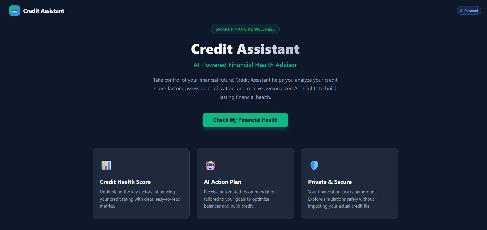
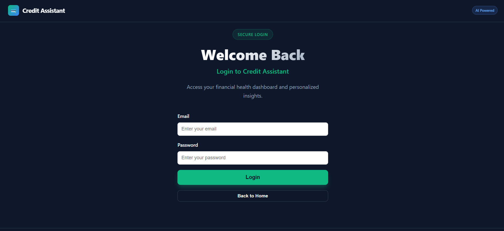
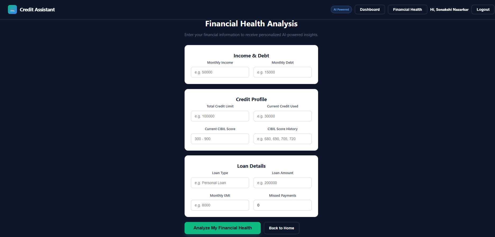
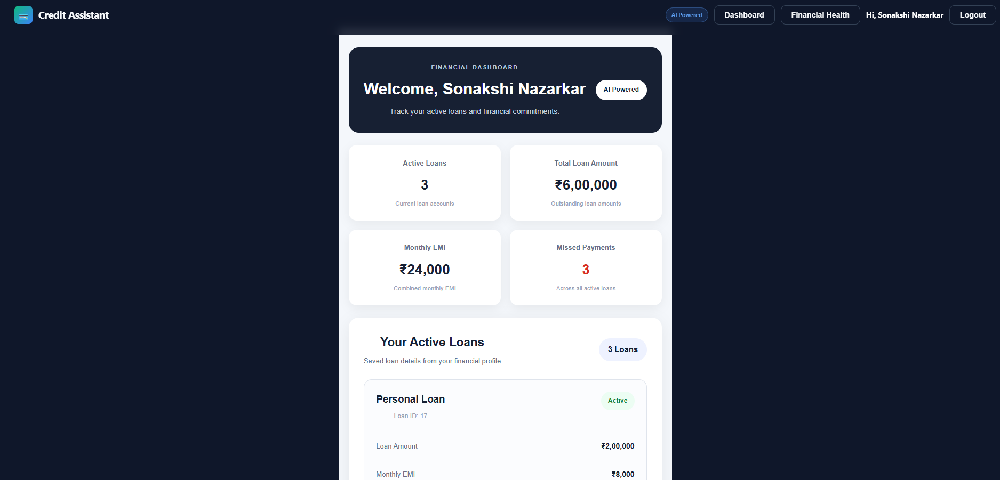
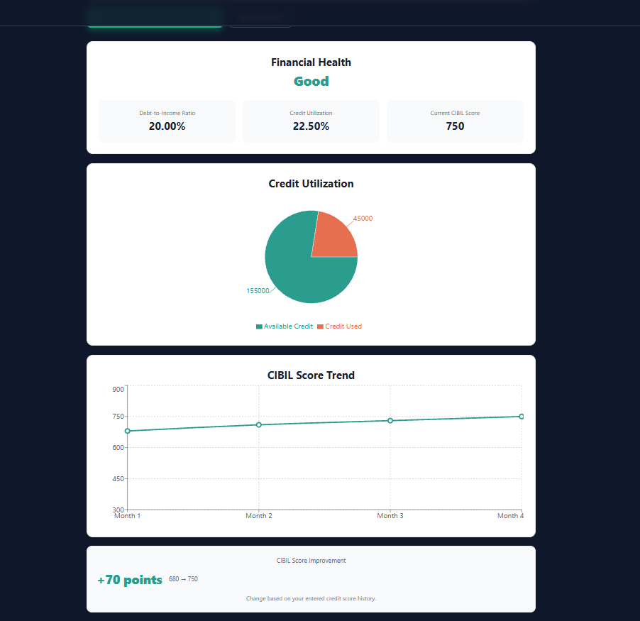
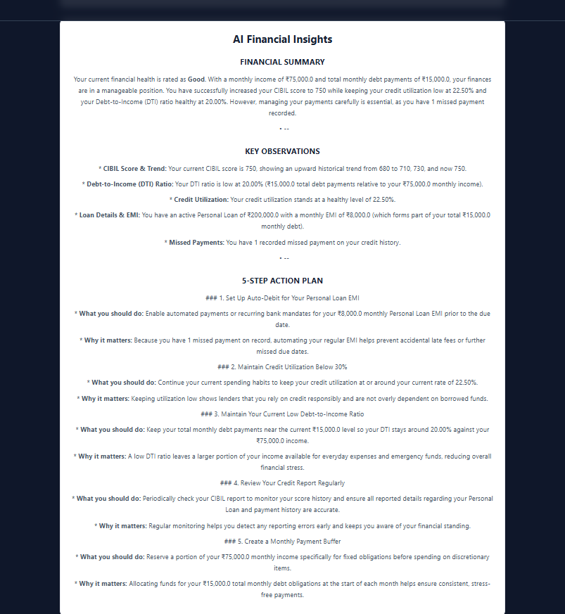

# Credit Assistant – AI-Powered Financial Health Advisor

Credit Assistant is an AI-powered financial health analysis web application that helps users understand their basic financial health using income, debt, credit utilization, CIBIL score, loan information, and payment history.

The application combines rule-based financial calculations with Google Gemini to provide personalized, easy-to-understand financial insights and a practical action plan.

## Features

- User registration and login
- Secure password hashing
- User-specific financial profiles
- User-specific loan records
- Financial dashboard
- Active loan tracking
- Missed payment tracking
- Debt-to-Income (DTI) ratio calculation
- Credit Utilization ratio calculation
- CIBIL score analysis
- CIBIL score history tracking
- CIBIL score trend visualization
- Overall financial health classification
- Credit utilization visualization using a pie chart
- Improvement Delta calculation
- Personalized AI-powered financial insights using Google Gemini
- Personalized 5-step financial action plan
- Frontend and backend validation
- Loading and error handling
- Responsible AI disclaimer
- Backend-protected Gemini API key
- REST API architecture
- SQLite database
- Cloud deployment using Render

## Screenshots

### Home Page



### Login & Registration



### Financial Information Form



### Financial Dashboard



### Financial Health Analysis



### AI Financial Insights



## How It Works

The application follows a simple workflow:

1. User creates an account or logs in.
2. User enters financial information.
3. The backend validates and stores the user's financial profile.
4. Loan information is stored for the logged-in user.
5. Rule-based calculations determine important financial metrics.
6. The application evaluates overall financial health.
7. Google Gemini generates personalized financial insights.
8. The dashboard displays financial metrics and visualizations.
9. The user receives a practical 5-step action plan.

## Financial Health Logic

The application evaluates financial health using three major indicators:

### 1. Debt-to-Income Ratio

DTI measures monthly debt obligations compared with monthly income.

**Formula:**

`DTI = (Monthly Debt / Monthly Income) × 100`

A lower DTI generally indicates that a smaller portion of monthly income is committed to debt obligations.

### 2. Credit Utilization

Credit utilization measures how much of the available credit limit is currently being used.

**Formula:**

`Credit Utilization = (Credit Used / Credit Limit) × 100`

The application uses this value as one of the indicators for evaluating financial health.

### 3. CIBIL Score

The application uses the user's current CIBIL score along with historical CIBIL scores to display the user's score trend.

The application does not guarantee a specific future CIBIL score.

## Improvement Delta

The application calculates the change between the first and latest CIBIL score recorded in the submitted history.

**Formula:**

`Improvement Delta = Latest CIBIL Score − First CIBIL Score`

This helps users understand the direction of their recorded score history.

## AI-Powered Financial Insights

Google Gemini is used to generate educational and personalized financial explanations.

The AI receives calculated financial information such as:

- Monthly income
- Monthly debt
- DTI ratio
- Credit utilization
- Current CIBIL score
- CIBIL score history
- Loan type
- Loan amount
- Monthly EMI
- Missed payments
- Overall financial health

The AI generates:

- Financial summary
- Key observations
- Personalized recommendations
- Exactly 5 practical action steps

### Responsible AI Design

The application follows a simple principle:

> **Code calculates; AI explains and personalizes.**

Financial metrics such as DTI and credit utilization are calculated using deterministic backend logic. Gemini is used primarily to explain the results and provide educational guidance.

The application does not guarantee a specific CIBIL score increase and does not provide investment advice.

## Authentication

The application supports:

- User registration
- User login
- Password hashing
- User-specific data
- Logout functionality

Passwords are hashed before being stored in the database.

Each user's financial profile and loan records are associated with their unique user ID.

## Database

The application uses SQLite with SQLAlchemy ORM.

### Database Models

The database contains the following main entities:

- `User`
- `FinancialProfile`
- `ScoreHistory`
- `Loan`

### Relationships

```text
User
│
├── FinancialProfile
│
├── ScoreHistory
│
└── Loans